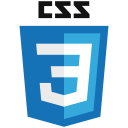

## Hello, i'm Carlos Mandele !  🤓

  
  
  
  

 
  
 </a>
  
  

#
 Data Scientist and Full Stack Python developer in progress

🎓 I have a degree in Building Technology.
 
🎓 I am currently in career transition to the universe of technology (IT) especially for data area, studying Bachelor of studying Science in Data Science.

🔭 I am looking for a job opportunity in the area.

🔭 I am also interested in application development and Python software.

💡 I am also interested in collaborating on any data science and open source python project.

☕ I like to play games, travel, listen to good music and drink a good wine (applause)..

You can ask me anything, I'll gladly answer it if I can

## 
|  |  |
| ------------- | ------------- |

-----

<!-- BIO:END -->

<!-- SKILLSET:START -->

## Technology Stack

<table>

<tr>
<td align="center" width="50%" valign="top">

### Frontend

</td>
<td align="center" valign="top">

### Data Science  ML  DL  NLP & AI

</td>
</tr>

<tr>
<td align="center" valign="top">

### Backend

</td>
<td align="center" valign="top">

### Database

</td>
</tr>

<tr>
<td align="center" valign="top">

### Mobile

</td>
<td align="center" valign="top">

### Cloud & DevOps

</td>
</tr>

<tr>
<td align="center" valign="top">

### Hardware & IoT

</td>
<td align="center" valign="top">

### Want to learn

</td>
</tr>

<tr>
<td align="center" valign="top">

### Tools & IDEs

</td>

</table>

 

<!-- SKILLSET:END -->

------
## Projects in progress 👇
